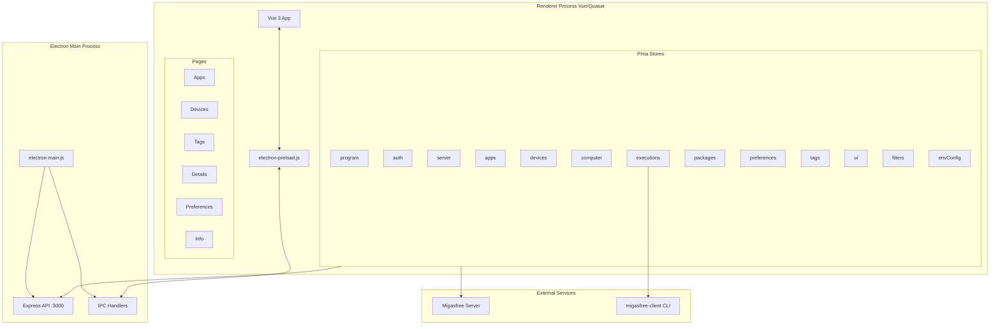
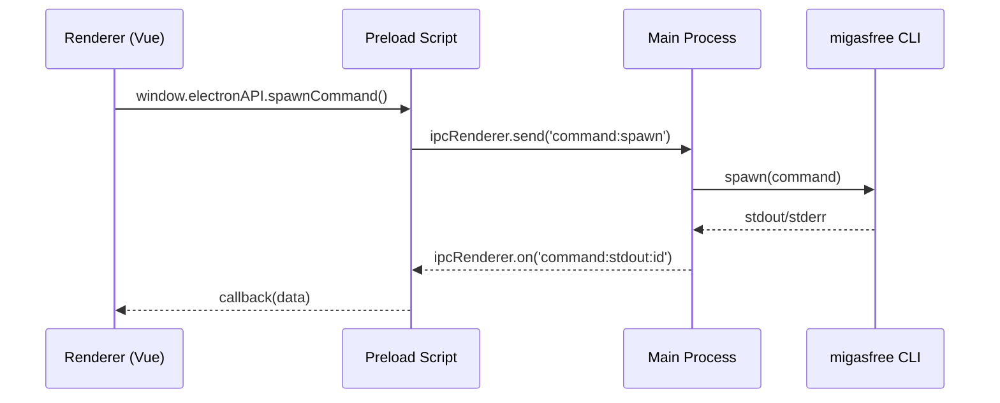
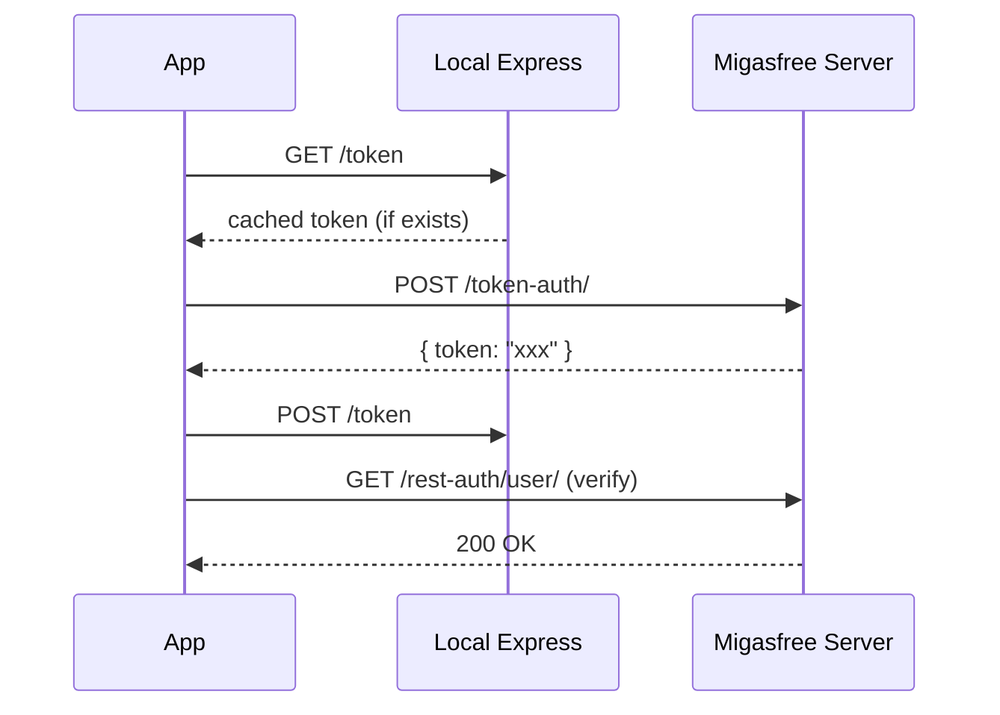

# Migasfree Play Architecture

## Overview

**Migasfree Play** is a desktop application that serves as a frontend for the Migasfree client. It allows users to install/uninstall available applications and manage devices through a graphical interface.

## Technology Stack

| Layer                | Technology        | Version    |
| -------------------- | ----------------- | ---------- |
| Desktop Framework    | Electron          | 39.x       |
| UI Framework         | Vue.js 3 + Quasar | 3.5 / 2.18 |
| State Management     | Pinia             | 3.x        |
| HTTP Client          | Axios             | 1.x        |
| Embedded Backend     | Express.js        | 5.x        |
| Internationalization | vue3-gettext      | 4.x        |
| Testing              | Vitest            | 4.x        |

---

## Architecture Diagram



---

## Project Structure

```
migasfree-play/
├── src-electron/           # Electron code (main process)
│   ├── electron-main.js    # Entry point, window management, IPC
│   └── electron-preload.js # Secure bridge between main and renderer
│
├── src/                    # Vue/Quasar code (renderer process)
│   ├── api/                # Embedded Express API
│   │   ├── index.js        # Express server configuration
│   │   ├── routes/         # API routes (7 modules)
│   │   └── utils.js        # API utilities
│   │
│   ├── stores/             # Global state (Pinia)
│   │   ├── program.js      # Main store, orchestration
│   │   ├── auth.js         # Token and user authentication
│   │   ├── server.js       # Server/client info and connection
│   │   ├── apps.js         # Available applications
│   │   ├── devices.js      # Device management
│   │   ├── computer.js     # Computer info
│   │   ├── executions.js   # CLI command execution
│   │   ├── packages.js     # Installed/available packages
│   │   ├── preferences.js  # User preferences
│   │   ├── tags.js         # Computer tags
│   │   ├── filters.js      # UI filters
│   │   ├── ui.js           # UI state
│   │   └── envConfig.js    # Environment config
│   │
│   ├── components/         # Vue components (21)
│   ├── pages/              # App pages (6)
│   ├── composables/        # Vue composables (2)
│   ├── layouts/            # Layouts
│   ├── router/             # Route configuration
│   ├── boot/               # Initialization plugins
│   ├── config/             # App configuration
│   ├── i18n/               # Translations (5 languages)
│   └── css/                # Global styles
│
├── test/                   # Unit tests
├── packaging/              # Debian packaging scripts
└── quasar.config.js        # Quasar configuration
```

---

## Inter-Process Communication (IPC)

The main process and renderer communicate through IPC channels:



### Available IPC Channels

| Channel                    | Type   | Description                   |
| -------------------------- | ------ | ----------------------------- |
| `app:get-sync-after-start` | invoke | Get sync-on-start flag        |
| `app:get-platform`         | invoke | Get platform (linux/win32)    |
| `app:get-env-config`       | invoke | Get environment configuration |
| `app:set-can-exit`         | send   | Allow/block window close      |
| `window:show`              | invoke | Show window                   |
| `window:is-minimized`      | invoke | Check if minimized            |
| `window:close`             | invoke | Close window                  |
| `command:spawn`            | send   | Execute system command        |
| `command:kill`             | send   | Terminate running command     |

---

## Embedded Express API

The application includes an Express server that acts as a proxy between the Vue frontend and the local system:

### Endpoints

| Route          | Description                               |
| -------------- | ----------------------------------------- |
| `/packages`    | Package management (installed, available) |
| `/preferences` | Read/write user preferences               |
| `/computer`    | Local computer information                |
| `/token`       | Authentication token management           |
| `/executions`  | Execution history                         |
| `/user`        | Privileged user verification              |
| `/tags`        | Computer tag management                   |

### Security

- CORS restricted to `localhost:9999`
- Rate limiting: 80 requests/minute
- Origin validation on all requests

---

## Initialization Flow

```mermaid
flowchart LR
    START([App Start]) --> ENV[Load EnvConfig]
    ENV --> PREFS[Read Preferences]
    PREFS --> CLIENT[Client Info & Version Check]
    CLIENT --> PROTO[API Protocol & Host]
    PROTO --> TOKEN[Get/Check Token]
    TOKEN --> SERVER[Server Info]
    SERVER --> COMPUTER[Computer Info]
    COMPUTER --> PARALLEL

    subgraph PARALLEL["Parallel Loading"]
        APPS[Load Apps]
        DEVICES[Load Devices]
        PACKAGES[Load Packages]
        TAGS[Load Tags]
        CATS[Load Categories]
    end

    PARALLEL --> READY([App Ready])
```



---

## State Stores (Pinia)

### Main Store: `program`

Orchestrates initialization and re-exports state from `auth` and `server` for backward compatibility:

```javascript
// Re-exported from auth and server stores
;(token, isTokenChecked, userIsPrivileged) // from auth
;(protocol, host, clientVersion, serverVersion, organization) // from server

// Own state
status // current initialization step
appIsStopped // app stopped due to error
```

### Core Stores

| Store    | Responsibility                              |
| -------- | ------------------------------------------- |
| `auth`   | Token management, user privileges           |
| `server` | Client/server version, protocol, host, URLs |

### Domain Stores

| Store         | Responsibility                               |
| ------------- | -------------------------------------------- |
| `apps`        | Application catalog, filtering, installation |
| `devices`     | Assigned and available devices               |
| `computer`    | Computer information (CID, UUID, IP, etc.)   |
| `packages`    | Installed, available packages, inventory     |
| `executions`  | History and CLI command execution            |
| `preferences` | User display preferences                     |
| `tags`        | Tags assigned to the computer                |

### Support Stores

| Store       | Responsibility                            |
| ----------- | ----------------------------------------- |
| `ui`        | Loading state, notifications, errors      |
| `filters`   | Active filters for apps/devices           |
| `envConfig` | Environment configuration (ports, limits) |

---

## Migasfree Server Communication

The application communicates with the Migasfree server through two types of API:

### Public API (no authentication)

```
/api/v1/public/server/info/
```

### Token API

```
/api/v1/token/catalog/apps/available/
/api/v1/token/catalog/categories/
/api/v1/token/computers/{id}/
/api/v1/token/devices/devices/available/
```

### Authentication Flow



---

## CLI Command Execution

The `executions` store manages the execution of migasfree client commands:

### Main Commands

| Command                   | Description            |
| ------------------------- | ---------------------- |
| `migasfree sync`          | Server synchronization |
| `migasfree install <pkg>` | Package installation   |
| `migasfree remove <pkg>`  | Package uninstallation |

### Output Processing

Command output is processed to:

- Convert ANSI codes to CSS classes for coloring
- Display progress in real-time
- Capture errors from stderr
- Notify the user upon completion

---

## Application Pages

| Route          | Page        | Description                     |
| -------------- | ----------- | ------------------------------- |
| `/apps`        | Apps        | Installable application catalog |
| `/devices`     | Devices     | Device management               |
| `/tags`        | Tags        | Computer tags                   |
| `/details`     | Details     | Execution history               |
| `/preferences` | Preferences | App settings                    |
| `/info`        | Info        | Computer and server information |

---

## Main Components

### Layout and Navigation

- `MainLayout.vue` - Main layout with sidebar menu
- `Menu.vue` - Section navigation
- `PageLayout.vue` - Reusable page layout

### Data Management

- `Apps.vue` / `AppDetail.vue` - Application list and detail
- `Devices.vue` / `DeviceDetail.vue` - Device list and detail
- `Tags.vue` - Tag management
- `Executions.vue` / `ExecutionDetail.vue` - Command history

### Support Components

- `FilterCard.vue` - Filter container
- `AppFilter.vue` / `DeviceFilter.vue` - Specific filters
- `Pagination.vue` - List pagination
- `CredentialsForm.vue` - Login form
- `Info.vue` - System information panel

---

## Internationalization

Supported languages:

- Spanish (es)
- Catalan (ca)
- Basque (eu)
- Galician (gl)
- French (fr)

Managed through `vue3-gettext` with `.po/.mo` files.

---

## Testing

Framework: **Vitest**

```bash
# Run tests
yarn test

# Tests with watch
yarn test:watch

# Coverage
yarn test:coverage
```

---

## Build and Packaging

```bash
# Development
yarn dev

# Production build
yarn build
```

Packaging generates:

- AppImage for Linux
- Windows installers (NSIS, MSI)
- Debian packages (.deb)

---

## Environment Variables

| Variable               | Description      | Default        |
| ---------------------- | ---------------- | -------------- |
| `MFP_EXPRESS_PORT`     | Express API port | 3000           |
| `MFP_QUASAR_PORT`      | Dev server port  | 9999           |
| `MFP_EXECUTIONS_LIMIT` | History limit    | 5              |
| `MFP_USER`             | Default user     | migasfree-play |
| `MFP_PASSWORD`         | Default password | migasfree-play |

---

## Main Dependencies

### Runtime

- `electron` - Desktop framework
- `vue` + `quasar` - UI framework
- `pinia` - State management
- `axios` - HTTP client
- `express` - Embedded backend
- `python-shell` - Python script execution

### Development

- `vitest` - Testing
- `eslint` + `prettier` - Linting/formatting
- `electron-builder` - Packaging
