# 🚀 Developer Onboarding Guide

> **Goal:** Understand the architecture and get your local environment running in under 15 minutes.

---

## 🎯 Big Picture

migasfree-play is an **Electron desktop application** that allows users to install/uninstall applications and manage devices through a graphical interface.

    subgraph ElectronApp["🖥️ Electron App"]
        subgraph MainProcess["Main Process"]
            EM["electron-main.js<br/>Window + IPC"]
        end

        subgraph RendererProcess["Renderer Process"]
            VUE["Vue 3 + Quasar<br/>:9999"]
            PINIA["Pinia Stores<br/>(13 stores)"]
        end
    end

    subgraph External["🌐 External"]
        SERVER["Migasfree Server<br/>(REST API)"]
        CLI["migasfree-client<br/>(Python CLI)"]
    end

    EM --> CLI
    VUE <--> PINIA
    PINIA --> EM
    PINIA --> SERVER

### Why This Architecture?

| **Electron** | Cross-platform desktop app (Linux, Windows) with system access |
| **Vue 3 + Quasar** | Modern UI with ready-to-use components, i18n support |
| **Pinia** | Reactive global state, better debugging than Vuex |
| **IPC + Python** | Secure communication with system-level Python scripts (Python 3.6+) |

---

## 📁 Key Directories

```
migasfree-play/
├── 📦 src-electron/           # Electron main process
│   ├── electron-main.js       # 👉 Window, IPC, CLI spawn
│   ├── electron-preload.js    # 👉 Secure bridge renderer ↔ main
│   ├── handlers/              # 👉 IPC Handlers
│   ├── resources/             # 👉 Static resources
│   │   └── scripts/           # 👉 Python scripts (.py)
│   └── python-utils.js        # 👉 Python execution utilities
│
├── 🎨 src/                    # Renderer process (Vue/Quasar)
│   ├── boot/                  # 👉 App initialization (axios, i18n)
│   ├── stores/                # 👉 BUSINESS LOGIC (Pinia)
│   │   ├── program.js         # Main orchestrator
│   │   ├── auth.js            # Token, privileges
│   │   ├── apps.js            # Application catalog
│   │   ├── devices.js         # Device management
│   │   ├── executions.js      # CLI command execution
│   │   └── ... (8 more)
│   │
│   ├── pages/                 # Main views
│   ├── components/            # 21 reusable components
│   └── i18n/                  # Translations (5 languages)
│
├── 🧪 test/                   # Unit tests
│   ├── stores/                # Pinia store tests
│   ├── components/            # Vue component tests
│   └── api/                   # Express API tests
│
└── 📋 packaging/              # Debian/RPM packaging
```

### Where to Find Things

| I need...         | Look in...                         |
| ----------------- | ---------------------------------- |
| Business logic    | `src/stores/`                      |
| Server API calls  | `src/stores/apps.js`, `server.js`  |
| Command execution | `src/stores/executions.js`         |
| Python scripts    | `src-electron/resources/scripts/`  |
| UI components     | `src/components/`                  |
| Views/pages       | `src/pages/`                       |
| Electron config   | `src-electron/electron-main.js`    |
| Tests             | `test/` (mirrors `src/` structure) |

---

## 🔄 Initialization Flow

When the app starts, the `program.js` store orchestrates this sequence:

```mermaid
flowchart LR
    START([🚀 Start]) --> ENV[EnvConfig]
    ENV --> PREFS[Preferences]
    PREFS --> CLIENT[Client Version]
    CLIENT --> PROTO[API Protocol]
    PROTO --> TOKEN[Auth Token]
    TOKEN --> SERVER[Server Info]
    SERVER --> COMPUTER[PC Info]
    COMPUTER --> PARALLEL

    subgraph PARALLEL["⚡ Parallel"]
        APPS[Apps]
        DEVICES[Devices]
        PACKAGES[Packages]
        TAGS[Tags]
    end

    PARALLEL --> READY([✅ Ready])
```



---

## 📡 IPC Communication

Vue (renderer) ↔ Electron (main) using `contextBridge`:

```javascript
// In Vue (stores/executions.js)
window.electronAPI.spawnCommand(id, 'migasfree', ['sync'])

// Communicates via electron-preload.js → electron-main.js
// Main process spawns the actual command
```

### Available IPC Channels

| Channel                    | Type   | Description                |
| -------------------------- | ------ | -------------------------- |
| `app:get-sync-after-start` | invoke | Get sync-on-start flag     |
| `app:get-platform`         | invoke | Get platform (linux/win32) |
| `app:get-env-config`       | invoke | Get environment config     |
| `app:set-can-exit`         | send   | Allow/block window close   |
| `window:show`              | invoke | Show window                |
| `command:spawn`            | send   | Execute system command     |
| `command:kill`             | send   | Terminate running command  |

---

## 🔐 Security Configuration

The app relies on environment variables for sensitive configuration. If missing, it falls back to defaults defined in `src/config/app.conf.js`.

> [!WARNING]
> Never use the default credentials in production. The main process will log a security warning if defaults are detected.

| Variable               | Description                        | Overrides Default |
| ---------------------- | ---------------------------------- | ----------------- |
| `MFP_USER`             | Username for server authentication | `migasfree-play`  |
| `MFP_PASSWORD`         | Password for server authentication | `migasfree-play`  |
| `MFP_EXECUTIONS_LIMIT` | Concurrent executions limit (int)  | `5`               |

---

## 🧪 Test Anatomy

```javascript
// test/stores/packages.test.js
import { describe, it, expect, vi, beforeEach } from 'vitest'
import { setActivePinia, createPinia } from 'pinia'

// Mock dependencies
vi.mock('src-electron/python-utils.js', () => ({
  pythonExecute: vi.fn(),
  getScriptsPath: vi.fn(() => '/mock/scripts'),
}))

describe('Packages Store', () => {
  beforeEach(() => {
    setActivePinia(createPinia())
    vi.clearAllMocks()
  })

  it('should fetch available packages', async () => {
    // Arrange, Act, Assert...
  })
})
```

### Running Tests

```bash
yarn test           # Run all tests
yarn test:watch     # Watch mode
yarn test:coverage  # With coverage
```

---

## 💡 Tips for New Developers

1. **Start with stores** - Business logic lives in `src/stores/`
2. **Use Vue DevTools** - Pinia has excellent integration
3. **Python scripts** - Located in `src-electron/resources/scripts/`, executed via `pythonExecute()`
4. **Hot reload** - Works for Vue, but `electron-main.js` changes require restart
5. **Debugging** - Run with `sudo migasfree-play debug` in production

---

## 🔗 Additional Resources

- [ARCHITECTURE.md](ARCHITECTURE.md) - Detailed technical documentation
- [Quasar Docs](https://quasar.dev/) - UI framework
- [Pinia Docs](https://pinia.vuejs.org/) - State management
- [Electron Docs](https://www.electronjs.org/docs) - Desktop framework

---

**Ready to contribute?** 🎉 Start by exploring the stores and tests to understand how data flows.
