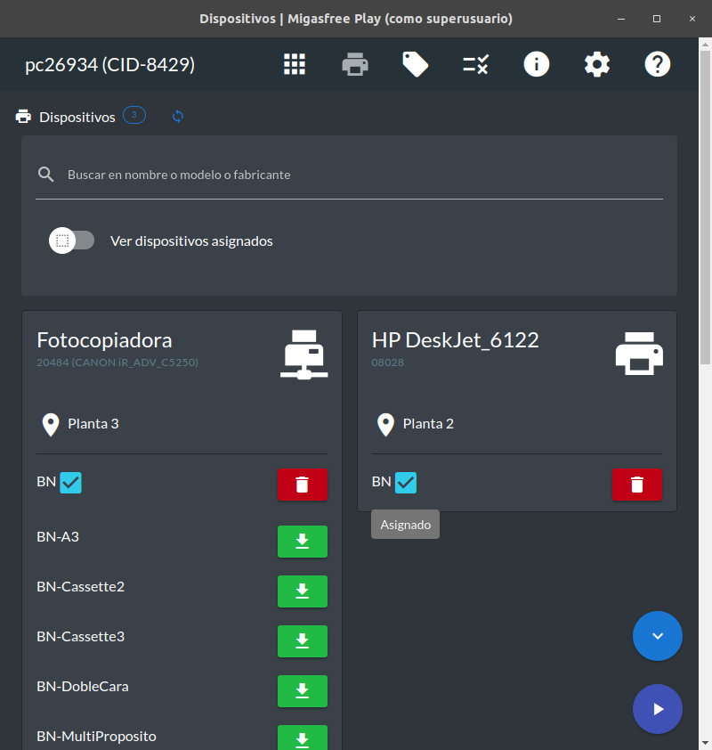

# Migasfree Play

[](https://www.gnu.org/licenses/gpl-3.0)
[](https://nodejs.org/)

Desktop application for the [Migasfree](https://github.com/migasfree) ecosystem. Provides a graphical interface to install/uninstall applications and manage devices on managed computers.

## Features

- 📦 **Application Catalog** - Browse and install available applications
- 🖨️ **Device Management** - Configure and manage assigned devices
- 🏷️ **Tag Management** - View and modify computer tags
- 🔄 **Synchronization** - Sync with Migasfree server
- 📊 **Execution History** - Track command execution logs
- 🌐 **Multi-language** - Available in 5 languages
- 🌙 **Dark Mode** - Full dark theme support

## Screenshots





## Tech Stack

| Layer             | Technology             |
| ----------------- | ---------------------- |
| Desktop Framework | Electron 39.x          |
| UI Framework      | Vue.js 3 + Quasar 2.18 |
| State Management  | Pinia 3.x              |

| Testing | Vitest 4.x |

## Quick Start

### Requirements

- Node.js >= 22.12.0
- Yarn >= 1.21.1
- migasfree-client >= 4.20 (production)

### Installation

```bash
git clone https://github.com/migasfree/migasfree-play.git
cd migasfree-play
yarn install
```

### Development

```bash
sudo yarn dev
```

### Production Build

```bash
yarn build
```

### Run Tests

```bash
yarn test
```

## Packaging

### Debian/Ubuntu

```bash
sudo apt install devscripts build-essential debhelper
yarn build
cd packaging
DEB_BUILD_OPTIONS=noautodbgsym debuild --no-lintian --no-tgz-check -us -uc
```

### RPM (Fedora/RHEL)

```bash
yarn build
cd packaging/rpm
./create-package
```

### Arch Linux

```bash
cd packaging
makepkg
```

## Production Usage

```bash
# Normal execution
sudo migasfree-play

# Sync immediately on start
sudo migasfree-play sync

# Debug mode
sudo migasfree-play debug
```

## Configuration

Settings file: `/root/.migasfree-play/settings.json`

```json
{
  "language": "es_ES",
  "show_language": true,
  "show_computer_link": true,
  "show_sync_details": false,
  "show_apps": true,
  "show_devices": true,
  "show_tags": true,
  "show_details": true,
  "show_preferences": true,
  "show_info": true,
  "show_help": true,
  "dark_mode": false,
  "show_dark_mode": true
}
```

### Available Languages

- English (en_US)
- Español (es_ES)
- Français (fr_FR)
- Català (ca_ES)
- Euskara (eu_ES)
- Galego (gl_ES)

### Environment Variables

| Variable | Description | Default |
| -------- | ----------- | ------- |

| `MFP_QUASAR_PORT` | Dev server port | 9999 |
| `MFP_EXECUTIONS_LIMIT` | History limit | 5 |
| `MFP_USER` | Default user | migasfree-play |
| `MFP_PASSWORD` | Default password | migasfree-play |
| `MFP_CMD_FLAGS` | Extra CLI flags | (empty) |

## Documentation

- [Architecture](./ARCHITECTURE.md) - Technical architecture documentation
- [Onboarding](./ONBOARDING.md) - Developer onboarding guide

## License

[GPL-3.0](LICENSE) © 2017-2026 Migasfree Team

## Links

- [Migasfree Project](https://migasfree.org)
- [Migasfree Server](https://github.com/migasfree/migasfree-backend)
- [Migasfree Client](https://github.com/migasfree/migasfree-client)
