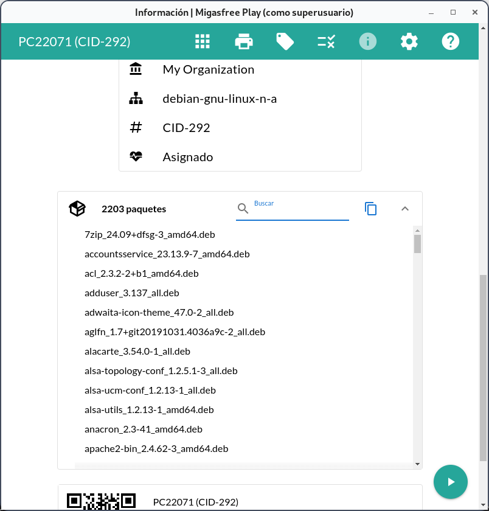

# Migasfree Play

[](https://www.gnu.org/licenses/gpl-3.0)
[](https://nodejs.org/)

Desktop application for the [Migasfree](https://github.com/migasfree) ecosystem. Provides a graphical interface to install/uninstall applications and manage devices on managed computers.

## Features

- 📦 **Application Catalog** - Browse and install available applications
- 🖨️ **Device Management** - Configure and manage assigned devices
- 🏷️ **Tag Management** - View and modify computer tags
- 🔄 **Synchronization** - Sync with Migasfree server
- 📊 **Execution History** - Track command execution logs
- 🌐 **Multi-language** - Available in 5 languages
- 🌙 **Dark Mode** - Full dark theme support

## Screenshots




## Tech Stack

| Layer             | Technology             |
| ----------------- | ---------------------- |
| Desktop Framework | Electron 39.x          |
| UI Framework      | Vue.js 3 + Quasar 2.18 |
| State Management  | Pinia 3.x              |

| Testing | Vitest 4.x |

## 📚 Documentation

The documentation is organized using the **Diátaxis** framework:

| Quadrant          | Purpose                           | Links                                                                        |
| :---------------- | :-------------------------------- | :--------------------------------------------------------------------------- |
| **Tutorials**     | Learning-oriented (Step-by-step)  | [Developer Onboarding](docs/ONBOARDING.md)                                   |
| **How-to Guides** | Task-oriented (Recipes)           | [User Guide](docs/USER_GUIDE.md), [Troubleshooting](docs/TROUBLESHOOTING.md) |
| **Explanation**   | Understanding-oriented (Concepts) | [Architecture](docs/ARCHITECTURE.md)                                         |
| **Reference**     | Information-oriented (Facts)      | [Technical Reference](docs/REFERENCE.md)                                     |

---

## Quick Start

### 1. Requirements

- Node.js >= 22.12.0
- Yarn >= 1.21.1
- Python >= 3.6
- migasfree-client >= 4.20 (production)

### 2. Installation

```bash
git clone https://github.com/migasfree/migasfree-play.git
cd migasfree-play
yarn install
```

### 3. Development

```bash
sudo yarn dev
```

For more details on commands and environment configuration, see the [Reference Guide](docs/REFERENCE.md).

---

## Security

Migasfree Play uses environment variables for secure configuration. By default, it uses insecure credentials which **must** be changed in production.

See [Reference: Environment Variables](docs/REFERENCE.md#🔐-environment-variables) for instructions.

## License

[GPL-3.0](LICENSE) © 2017-2026 Migasfree Team

## Links

- [Migasfree Project](https://migasfree.org)
- [Migasfree Server](https://github.com/migasfree/migasfree-backend)
- [Migasfree Client](https://github.com/migasfree/migasfree-client)
