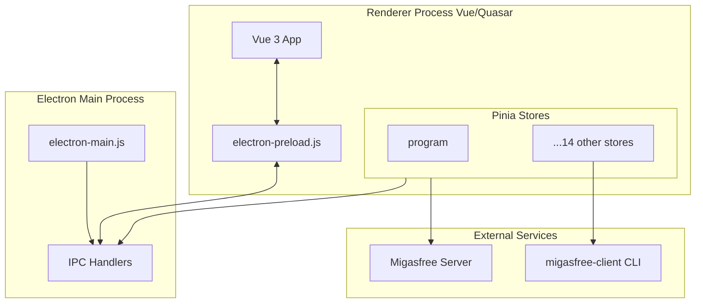

# Architecture Explanation

This document explains the high-level design and concepts behind **Migasfree Play**.

> **Note**: For a developer setup guide, see [ONBOARDING.md](ONBOARDING.md). For a technical reference of IPC channels and variables, see [REFERENCE.md](REFERENCE.md).

---

## 🏛️ High-Level Design

The application follows the **Electron process model**, separating system-level operations from user interface rendering.

## 🧠 State Orchestration (Pinia)

Instead of a single monolithic state, the application uses **modular Pinia stores** to manage different domain logic areas. The `program` store acts as the main orchestrator, managing the initialization sequence and error states.

### Initialization Sequence

The application follows a strict parallel initialization flow to ensure data consistency:

1. Environment Configuration & Preferences.
2. Client Information & Version discovery.
3. Authentication Token verification.
4. Parallel loading of Apps, Devices, and Packages.

## 📡 Secure IPC Bridge

To ensure security, the renderer process has **zero access** to Node.js APIs. Communication with the system is handled through a secure `contextBridge` in `electron-preload.js`, which exposes a limited and sanitized API to the Vue application.

For more details on the specific channels available, see the [Reference Guide](REFERENCE.md#ipc-channels).

---

_Back to [README.md](../README.md)_
