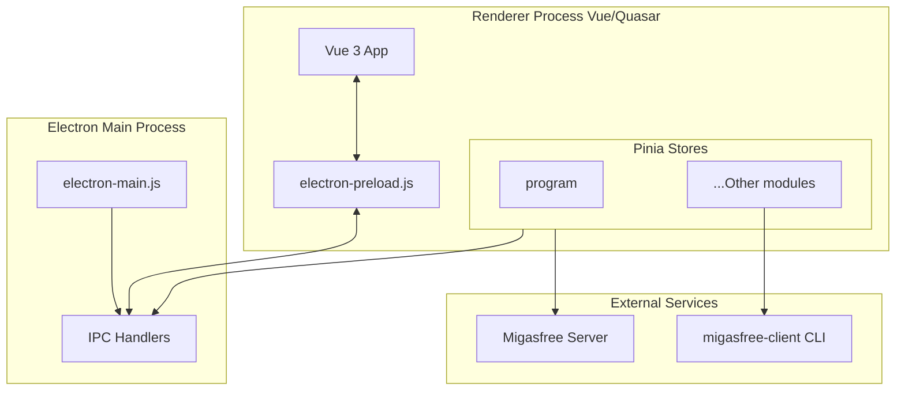

# Architecture Explanation

This document explains the high-level design and concepts behind **Migasfree Play**.

> **Note**: For a developer setup guide, see [Developer Onboarding](../tutorials/onboarding.md). For a technical reference of IPC channels and variables, see [Technical Reference](../reference/technical.md).

---

## 🏛️ High-Level Design

The application follows the **Electron process model**, separating system-level operations from user interface rendering.

## 🧠 State Orchestration (Pinia)

Instead of a single monolithic state, the application uses **modular Pinia stores** to manage different domain logic areas. The `program` store acts as the main orchestrator, managing the initialization sequence and error states.

### Initialization Sequence

The application follows a strict parallel initialization flow to ensure data consistency:

1. **Environment & Preferences**: Load environment variables and user settings.
2. **Client Identification**: Discover Migasfree Client version and server protocol.
3. **Authentication**: Secure Token verification or request.
4. **Computer Identity**: Retrieve CID (Computer ID) and system characteristics.
5. **Parallel Loading**: Asset loading of Apps, Devices, Tags, and Packages.

## 📡 Secure IPC Bridge

To ensure security, the renderer process has **zero access** to Node.js APIs. Communication with the system is handled through a secure `contextBridge` in `electron-preload.js`, which exposes a limited and sanitized API to the Vue application.

For more details on the specific channels available, see the [Technical Reference](../reference/technical.md#ipc-channels).

## ⚙️ Hybrid Command Execution Strategy (v4 vs v5 Client)

To maintain complete backward compatibility while optimizing performance and security for modern setups, the backend employs a hybrid execution strategy based on the detected `migasfree-client` version:

- **Legacy Client (v4.x)**: Electron delegates operations to the legacy Python script handlers (e.g., `packages_available.py`, `packages_installed.py`, `packages_inventory.py`, `user_check.py`) using the `pythonExecute` bridge.
- **Modern Client (v5.x+)**: Electron communicates directly and securely with the native `migasfree` CLI via the `cliExecute` bridge, bypassing intermediate script wrappers entirely.

This execution is secured by running processes directly with argument arrays (via Node's `execFile`) to completely eliminate command injection vectors. All modern CLI queries utilize explicit, self-documenting option names (e.g., `--quiet`, `--available`, `--installed`, `--check`, `--user`, `--pwd`) for clarity and maintainability.

---

_Back to [README.md](../../README.md)_
